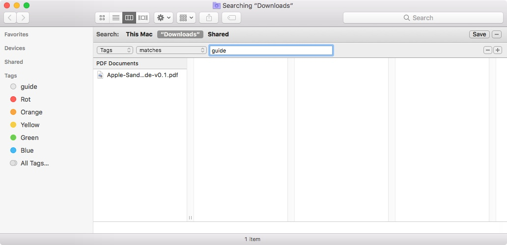
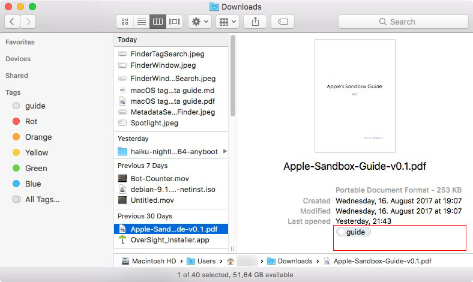
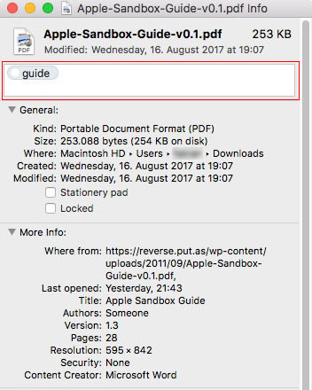
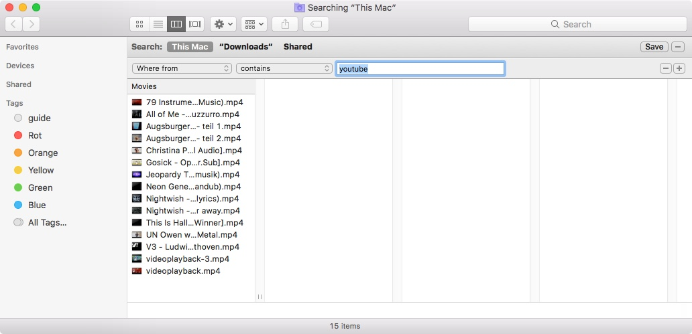

# tags on files in macOS

[TOC]

## Tags

### Why should you care?

Like most people, you probably never used those ominous colourful tags.

So why start now?
Tags offer a very fine level of control over your files independent from where in the system they are.  

#### Usage example Finder

Let's say you have a lot of files that contain tutorials of some sort. Some may be PDF's some may be videos and others may be screenshots of websites or single pictures.

Now you could of course put all those files in one big folder labled 'tutorials' but what if those files were tutorials for different things?  
Again you could put the tutorials in folders describing the topic of the tutorial and put these folders in a global tutorial folder but that might not be what you're after. You could very well want the tutorials near the files they are supposed to help you create.  

Now if you did end up having you tutorials all over the place and you still wanted to get an overview of just how studious you've been you might find it difficult to remember where all those files are.  

You could, of course, use Spotlight to search for files containing the word tutorial or for all pdf files but that might also give you a list of all your other eBooks and it might miss those tutorials not labled as such but rather labled as something like 'guide' or 'how-to'.

Using tags, however, allows you to search for files of every type everywhere at once on the condition that it has the 'tutorial'- or 'guide'-tag in it's metadata.




#### Usage example Terminal

##### Viewing tags

Issuing ```mdls -name kMDItemUserTags [filename]``` gives you something like this:

````
kMDItemUserTags = (
    guide
)
````

##### Searching for tags

Issuing mdfind ```'kMDItemUserTags == "guide"'``` gives you something like this:

````
/Users/USERNAME/Downloads/Apple-Sandbox-Guide-v0.1.pdf
````

#### How to set tags

Setting tags can be accomplished in two ways. The first is to go into the _Get Info_-dialog of a file via context-click. The other is in the Finder-window below the file preview when the file is selected.



#### How to delete tags from the system

Go to Finder > Prefernces > Tags  
Then delete the tags you don't need anymore.

## Metadata-attributes

### What it is

Metadata attributes are additional pieces of information about a file depending on what the file contains and where it came from.  

#### Example

To view all metadata-attributes of a file you can either use the _Get Info_-option in the context menu or use the command ```mdls``` on a file. This might output something like this:

````
_kMDItemOwnerUserID            = 503
kMDItemAuthors                 = (
    Someone
)
kMDItemContentCreationDate     = 2017-08-16 17:07:58 +0000
kMDItemContentModificationDate = 2017-08-16 17:07:58 +0000
kMDItemContentType             = "com.adobe.pdf"
kMDItemContentTypeTree         = (
    "com.adobe.pdf",
    "public.item",
    "com.adobe.pdf",
    "public.data",
    "public.composite-content",
    "public.content"
)
kMDItemCreator                 = "Microsoft Word"
kMDItemDateAdded               = 2017-08-16 17:07:58 +0000
kMDItemDisplayName             = "Apple-Sandbox-Guide-v0.1.pdf"
kMDItemEncodingApplications    = (
    "Mac OS X 10.6.8 Quartz PDFContext"
)
kMDItemFSContentChangeDate     = 2017-08-16 17:07:58 +0000
kMDItemFSCreationDate          = 2017-08-16 17:07:58 +0000
kMDItemFSCreatorCode           = ""
kMDItemFSFinderFlags           = 0
kMDItemFSHasCustomIcon         = (null)
kMDItemFSInvisible             = 0
kMDItemFSIsExtensionHidden     = 0
kMDItemFSIsStationery          = (null)
kMDItemFSLabel                 = 0
kMDItemFSName                  = "Apple-Sandbox-Guide-v0.1.pdf"
kMDItemFSNodeCount             = (null)
kMDItemFSOwnerGroupID          = 20
kMDItemFSOwnerUserID           = 503
kMDItemFSSize                  = 253088
kMDItemFSTypeCode              = ""
kMDItemKind                    = "Portable Document Format (PDF)"
kMDItemLastUsedDate            = 2017-08-24 19:43:59 +0000
kMDItemLogicalSize             = 253088
kMDItemNumberOfPages           = 28
kMDItemPageHeight              = 842
kMDItemPageWidth               = 595
kMDItemPhysicalSize            = 253952
kMDItemSecurityMethod          = "None"
kMDItemTitle                   = "Apple Sandbox Guide"
kMDItemUseCount                = 5
kMDItemUsedDates               = (
    "2017-08-15 22:00:00 +0000",
    "2017-08-17 22:00:00 +0000",
    "2017-08-23 22:00:00 +0000"
)
kMDItemUserTags                = (
    guide
)
kMDItemVersion                 = "1.3"
kMDItemWhereFroms              = (
    "https://reverse.put.as/wp-content/uploads/2011/09/Apple-Sandbox-Guide-v0.1.pdf",
    ""
)
````

To get a list of all possible attributes use ```mdimport -A```

#### Utilizing metadata-attributes in search

Let's say we want to know every file we downloaded from youtube.

```mdfind 'kMDItemWhereFroms == "*youtube*"'```

The result might be something like this:

````
/Users/USERNAME/Downloads/Mp4s tmp/Jeopardy Theme (Wartemusik).mp4
/Users/USERNAME/Downloads/Mp4s tmp/Nightwish - Over the Hills and far away.mp4
/Users/USERNAME/Downloads/Mp4s tmp/All of Me - Francesco Buzzurro.mp4
/Users/USERNAME/Downloads/Mp4s tmp/Neon Genesis Evangelion - Cruel Angel's Thesis (Full English Fandub).mp4
/Users/USERNAME/Downloads/Mp4s tmp/Christina Perri - Human [Official Audio].mp4
````

#### Utilizing metadata-attributes in search in Finder



## Additional References

For more Info refer to the man-pages

mdimport(1)  

mdls(1)  

mdfind(1)

For help with more complex queries refer to:  
https://ss64.com/osx/mdfind.html